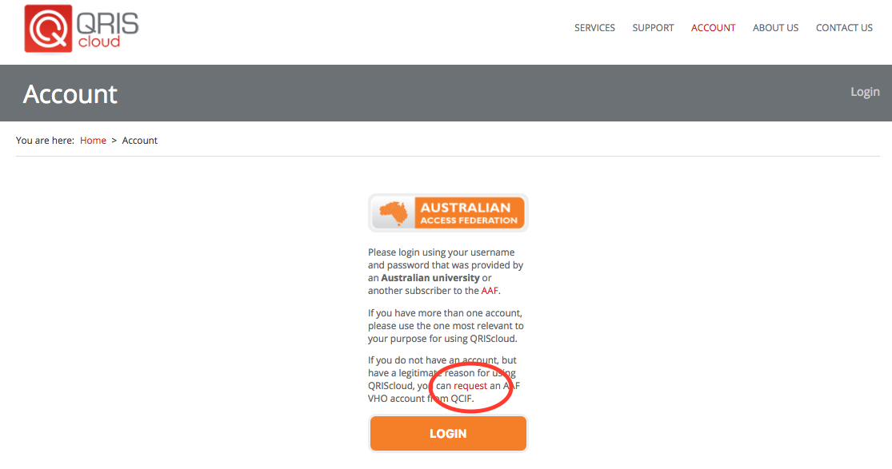
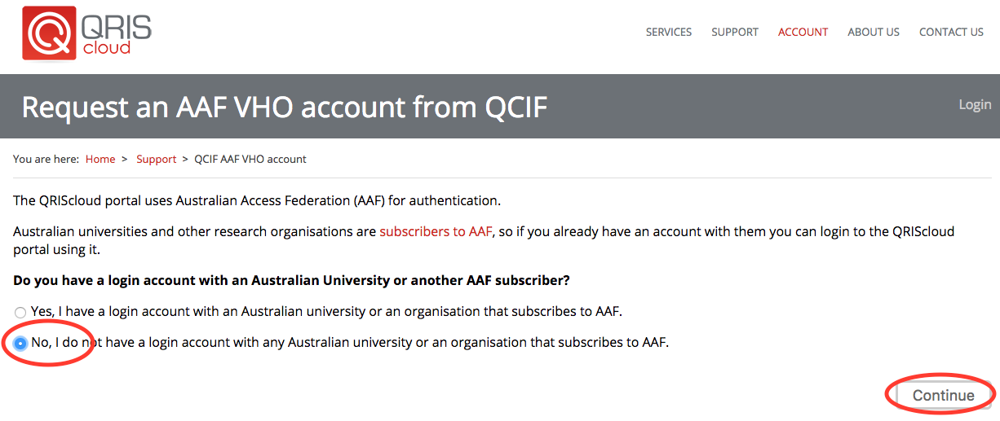
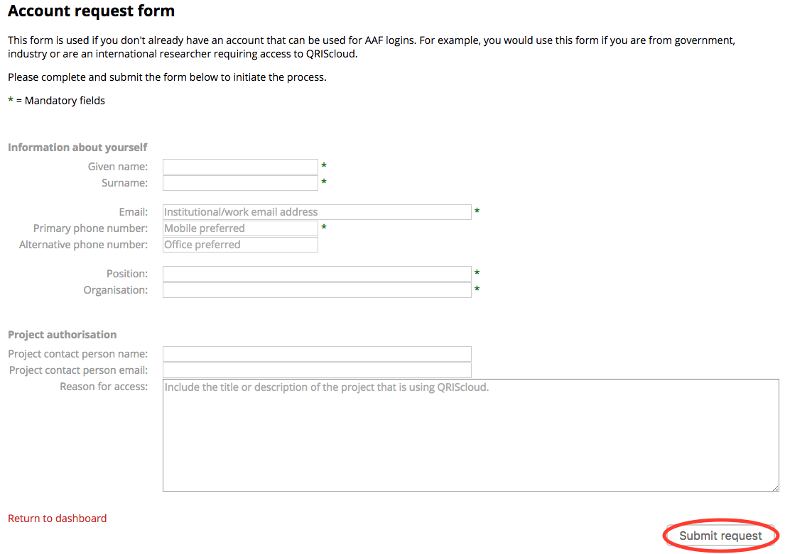

International access to QRIScloud
=================================

.. raw:: html

    <style>.document img { box-shadow: 0 0.5em 1em #999, 0 0.5em 2em #999; } </style>

Before you can access Mediaflux or Aspera Shares at JCU an account is required on QRIScloud.
Please complete all steps 1 through to 4.

What is QRIScloud ?
```````````````````

QRIScloud is a service that provides compute and storage to researchers. It is run by QCIF (www.qcif.edu.au)
JCU is a member of QCIF, as are other Queensland universities. The JCU eResearch Centre works closely
with QCIF to provide these services.

Apply for an Account
--------------------

1. Navigate to https://www.qriscloud.org.au and click on 'Account'

.. image:: _static/QRIScloud_main.png
   :alt: Login page for QRIScloud services
   :class: with-border

2. Now, click on 'request'



3. If you do not have a login with an Australian University or another member of the Australian Access Federation (AAF),
click 'No' and then 'continue'.



4. Complete the following form with as many details as possible. Then click 'Submit request'



QRIScloud will contact you once the request has been actioned.
