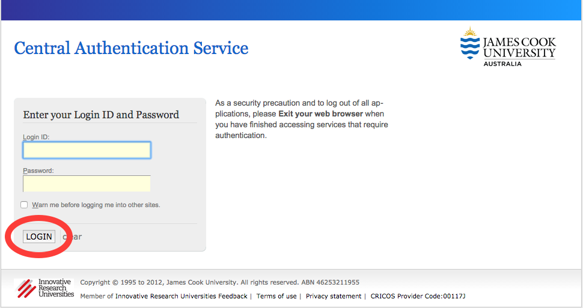

Creating your Access Credential
===============================

Before you can access Mediaflux or Aspera Shares at JCU an account is required on QRIScloud.

What is QRIScloud ?
```````````````````

QRIScloud is a service that provides compute and storage to researchers. It is run by QCIF (www.qcif.edu.au)
JCU is a member of QCIF, as are other Queensland universities. The JCU eResearch Centre works closely
with QCIF to provide these services.

Creating an Account
-------------------

Navigate to https://services.qriscloud.org.au and click on 'Login'

.. image:: _static/QRIScloud_login.png
   :width: 100%
   :alt: Login page for QRIScloud services

Search for "James Cook University", select it and click 'Continue to your organisation'

.. image:: _static/QRIScloud_AAF.png
   :width: 100%
   :alt: Select your organisation

You will be redirected to the standard JCU login page. Please enter your credentials.



Complete your profile. This information will allow QRIScloud to contact you regarding
any compute and storage services you use.

.. image:: _static/QRIScloud_profile.png
   :width: 100%
   :alt: QRIScloud profile form


Generating your credential
--------------------------

On the top right hand corner, click on 'My Credential'.
This page allows you to generate your username and password or to reset your password if required.


The username and password is used to access Mediaflux and/or Aspera Shares at JCU.
