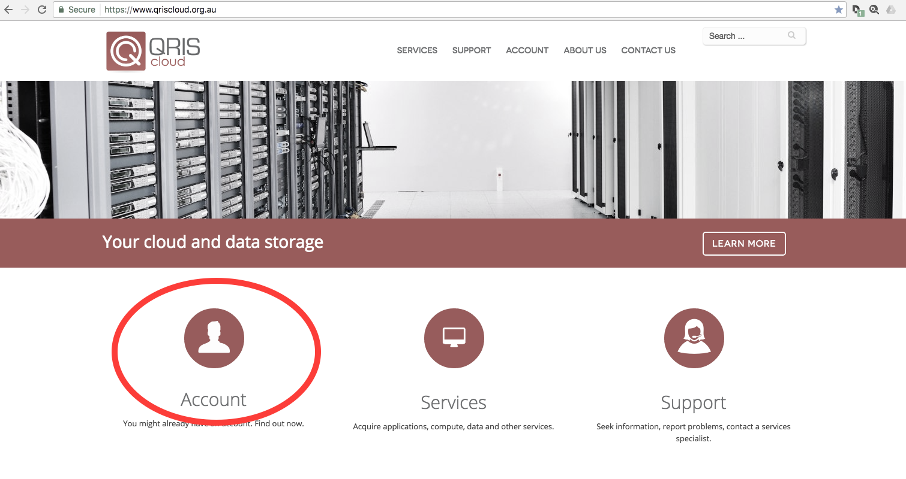
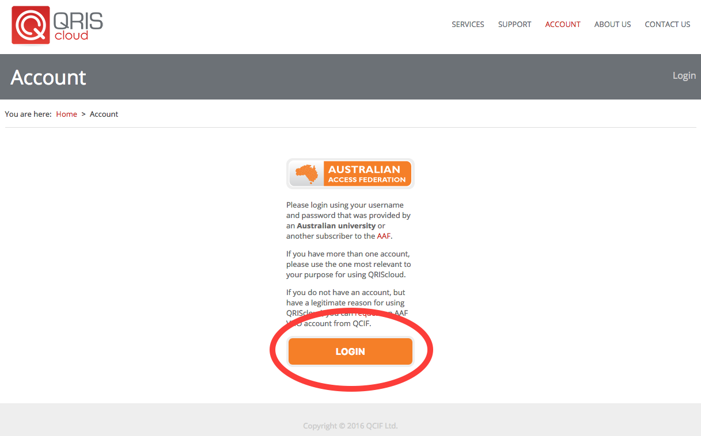
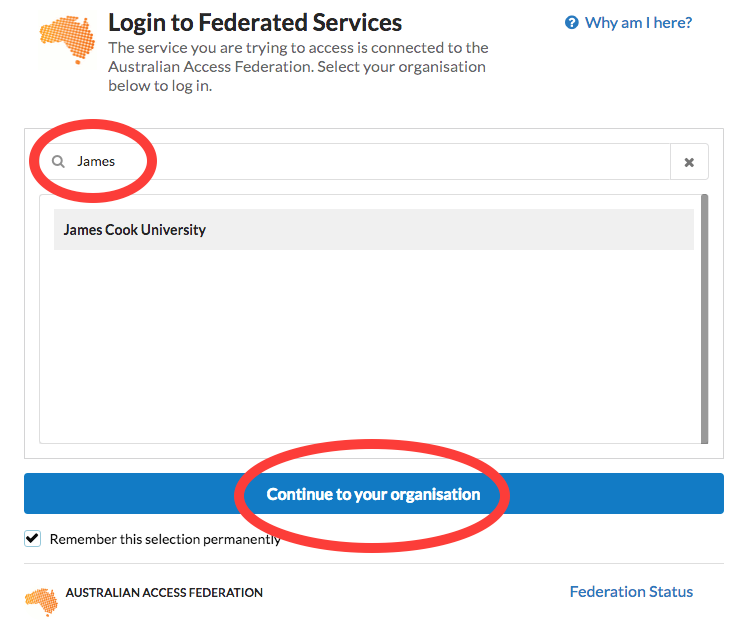
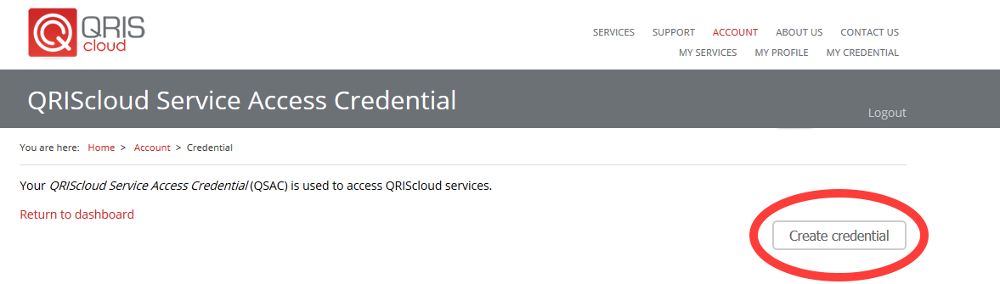

Creating your Access Credential
===============================

Before you can access Mediaflux or Aspera Shares at JCU an account is required on QRIScloud.

What is QRIScloud ?
```````````````````

QRIScloud is a service that provides compute and storage to researchers. It is run by QCIF (www.qcif.edu.au)
JCU is a member of QCIF, as are other Queensland universities. The JCU eResearch Centre works closely
with QCIF to provide these services.

Creating an Account
-------------------

Navigate to https://www.qriscloud.org.au and click on 'Account'



Now, click on 'Login'




Search for "James Cook University", select it and click 'Continue to your organisation'



You will be redirected to the standard JCU login page. Please enter your credentials.

.. image:: _static/JCU_cas.png
   :width: 100%
   :alt: Select your organisation

Complete your account registration. This information will allow QRIScloud to contact you regarding
any compute and storage services you use.


Your account on QRIScloud has now been created.
Continue below to create your QRIScloud Access Credential. This will provide you with a username
and password for accessing Mediaflux and/or Aspera Shares at JCU.

Generating your credential
--------------------------

On the top right hand corner, click on 'My Credential'.
This page allows you to generate your username and password or to reset your password if required.

.. image:: _static/QRIScloud_acct_created.png
  :width: 100%
  :alt: QRIScloud account registered

Click on 'Create Credential'



Your username and password have now been generated. Remember them, they will be used to access Mediaflux and/or Aspera Shares at JCU.
They can also be used to access other services provided by QRIScloud.

.. image:: _static/QRIScloud_QSAC_generated.png
   :width: 100%
   :alt: QRIScloud Service Access Credential generated
