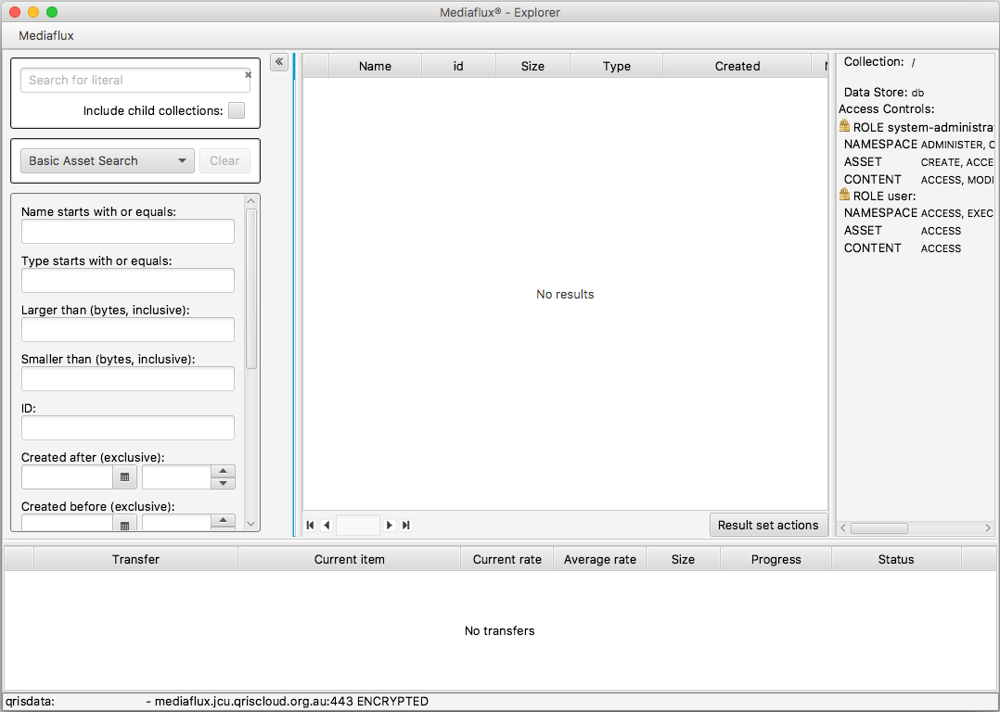

Mediaflux Explorer Access
=========================

.. raw:: html

    

What is Mediaflux Explorer ?
----------------------------

Mediaflux Explorer is another way to access your data managed by Mediaflux. Currently at JCU,
your data stored in Mediaflux can be accessed by three methods:

- Mediaflux Desktop - https://mediaflux.jcu.qriscloud.org.au/desktop/?dti=no
- SFTP - http://tdh-services.readthedocs.io/en/latest/mediaflux_sftp.html
- Mediaflux Explorer

Mediaflux Explorer is a standalone program that you run on your computer. Since Mediaflux
Desktop runs in a  web browser, for security reasons it is difficult to transfer data and
access the local filesystem.

By running directly on your operating system, Mediaflux Explorer allows fast, reliable
and scalable access to local hard drives and network hardware.

Requirements
------------

Oracle Java 1.8 is required to run Mediaflux Explorer.

To download Java: https://www.java.com

.. important::
   Which version of Java do I have ?

   * On Windows open the 'Command Prompt'
   * On Mac, open the 'Terminal' application
   * Enter 'java -version'

Obtaining Mediaflux Explorer
----------------------------

Download the current version of the Explorer.
http://www.arcitecta.com/software/mexplorer/mexplorer-1.3.6.jar

(Jay consider putting a copy in MF and making it public, call it mexplorer_latest.jar,
might be easier, no need to update doco)

Mediaflux Explorer Documentation
--------------------------------

The user manual is available from the Mediaflux Desktop. The Desktop is the best
place to obtain all up to date Mediaflux documentation.

1. Login to Mediaflux Desktop - https://mediaflux.jcu.qriscloud.org.au/desktop/?dti=no

2. Open 'Reference Books'

3. Open 'Mediaflux Explorer'

4. Click on the 'Download as PDF' button.

.. image:: _static/Mediaflux_book_download.png
   :alt: FileZilla new site creation.

Running Mediaflux Explorer
--------------------------

1. Open the folder where Mediflux Explorer was saved.

2. Double click on mexplorer-1.3.6.jar.

3. The login settings you need are:

- Protocol: https
- URL: mediaflux.jcu.qriscloud.org.au
- Port: 443
- Domain: qrisdata
- User: your QRIScloud username
- Password: your QRIScloud password

4. Once logged in your screen should look like this

5. Please refer to the Mediaflux Explorer documentation for further details.

Querying you data
-----------------

Queries can be customised for your data. On the left side of the image below is the default Basic Asset Search query setup for all collections.
This may be enough for your needs. If not, please refer to the Mediaflux Explorer documentation or contact QRIScloud for assistance. support@qriscloud.org.au

