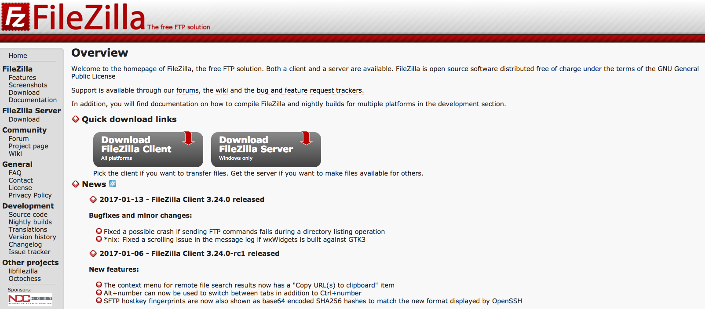
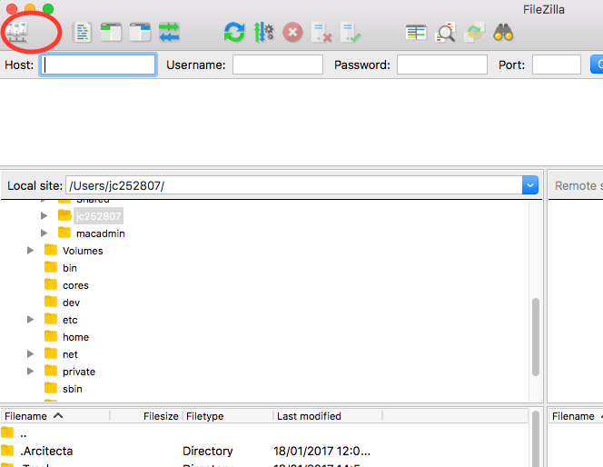
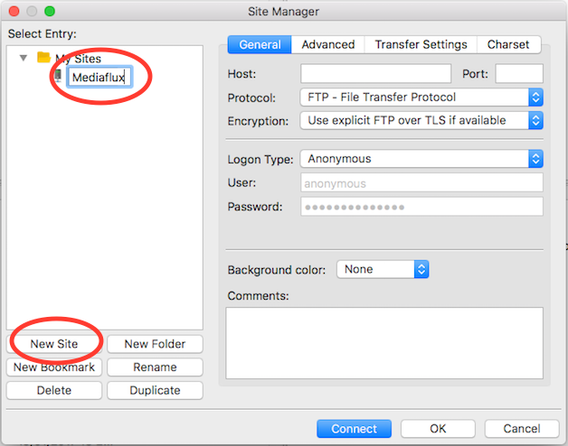
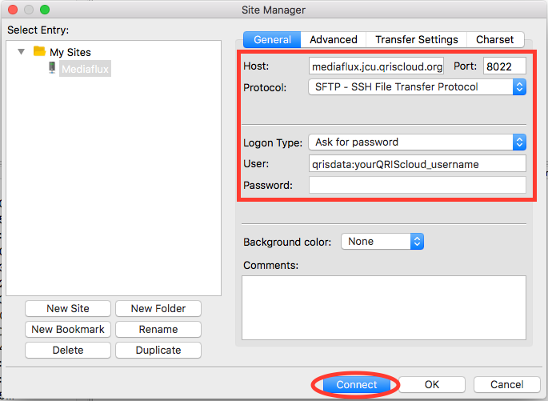
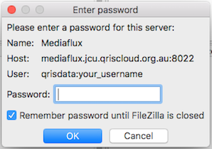
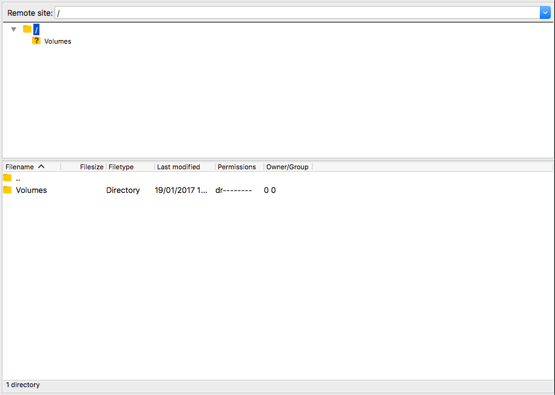
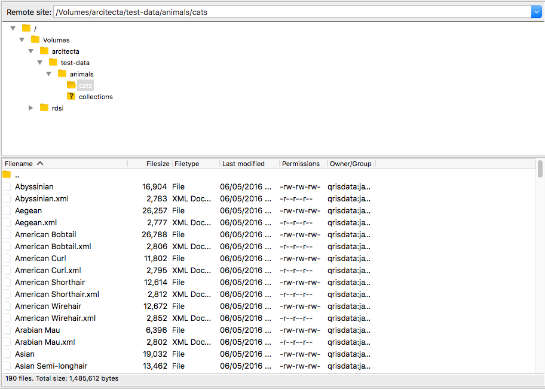

Mediaflux SFTP Access
=====================

.. raw:: html

    

What is SFTP ?
--------------

SFTP is also known at SSH File Transfer Protocol or Secure File Transfer Protocol.
It is commonly used to move data around.

The eResearch Centre staff like to use FileZilla, https://filezilla-project.org/.
Many SFTP clients are available, the list depends on the platform you use.
Here are a few others:

- WinSCP - https://winscp.net
- Cyberduck - https://cyberduck.io

The following instructions are based around FileZilla.
If you are using another SFTP client see point 6 for the Mediaflux SFTP settings.

Obtain FileZilla
----------------

1. Navigate to https://filezilla-project.org/ and click on 'Download'

2. Once downloaded, install the application on your machine.

3. Start up FileZilla.

Connecting to Mediaflux using SFTP
----------------------------------

4. In FileZilla click on the 'site manager' button.

5. Click on 'New Site' and create a new site for Mediaflux.

6. Complete the following fields:

- Host: 'mediaflux.jcu.qriscloud.org.au'
- Port: '8022'
- Protocol: 'SFTP'
- Logon Type: 'Ask for password', or whichever option you prefer.
- User: 'qrisdata:yourQRIScloud_username' qrisdata is the domain, it is required. Make sure you enter your username.

  Click Connect.

7. Enter your password,

8. Where is my data ?

Mediaflux data is accessible under the /Volumes folder. Open up this folder.

Any Mediaflux namespaces you have access to will be displayed. In most cases, these will be available under
/Volumes/rdsi.

What are these extra .xml files ?
---------------------------------

Mediaflux creates 'metadata' when you ingest assets (files) into the system. The extra '.xml' or 'sidecar' files
are shown in SFTP as they represent the 'metadata' for each asset (file).

If you would prefer to not see the 'metadata' sidecar files for your collection, please create a ticket on QRIScloud by emailing support@qriscloud.org.au

Connecting to Mediaflux using SFTP on the command line ?
--------------------------------------------------------

The following is an example on how to connect using SFTP on the command line.

sftp -P 8022 (domain):(user)@mediaflux.jcu.qriscloud.org.au

where:

- domain: qrisdata
- user: QRIScloud user name.
- password: you will be prompted to enter this.
