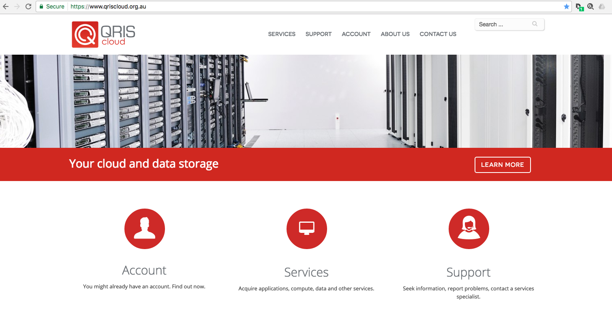
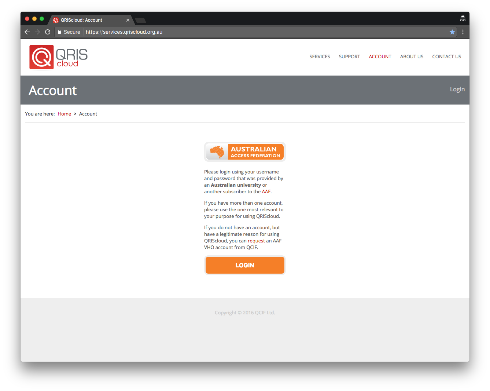
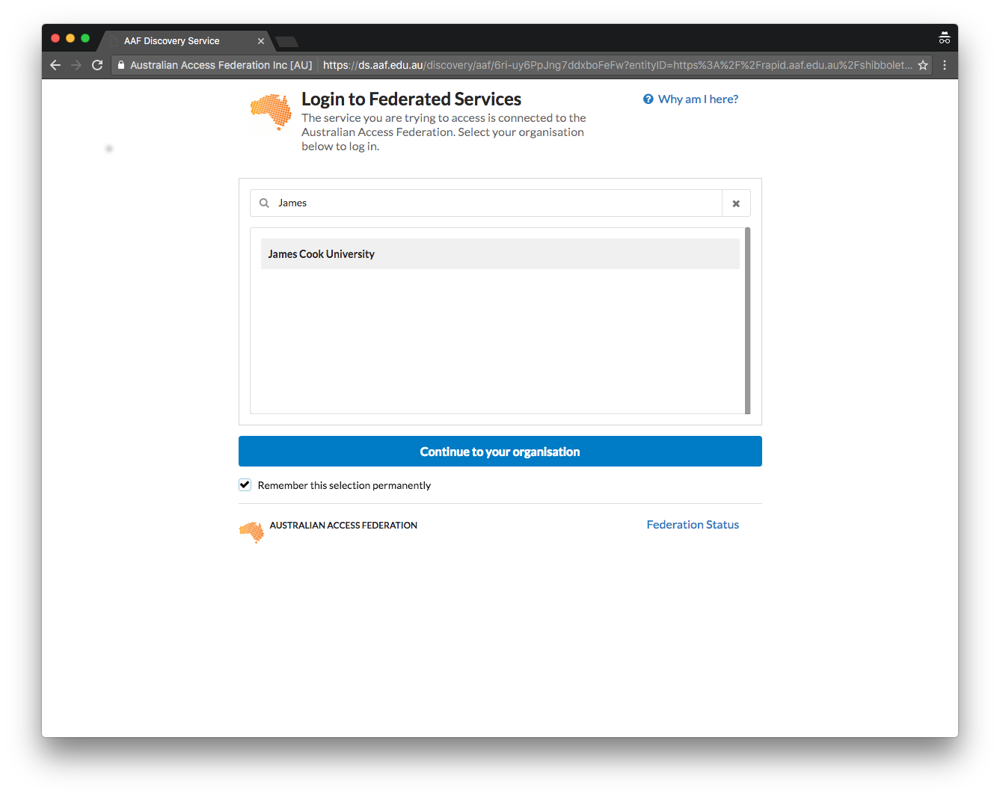
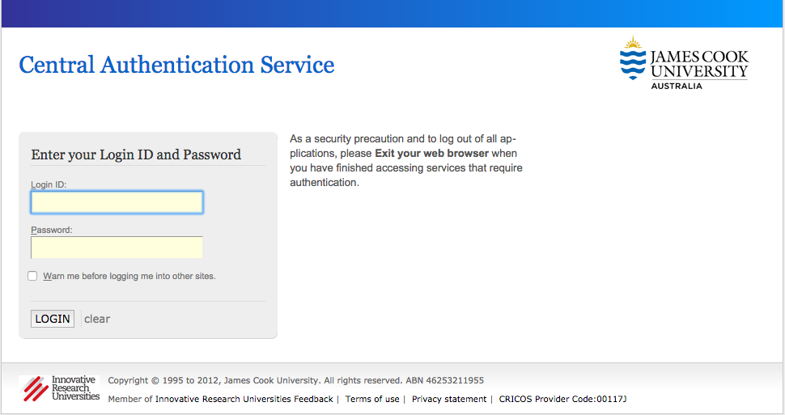
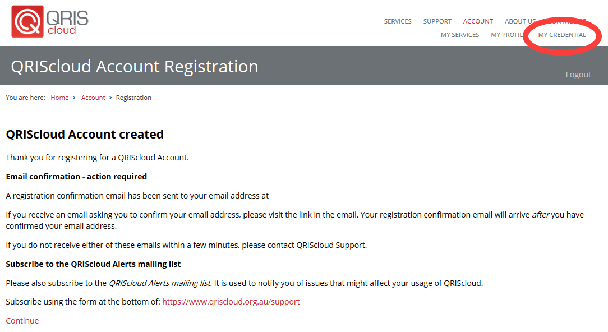
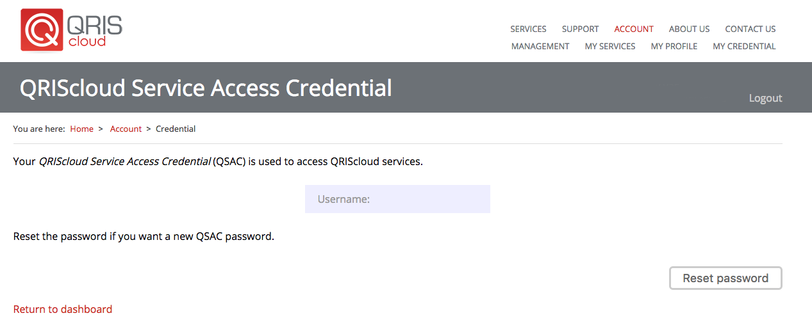
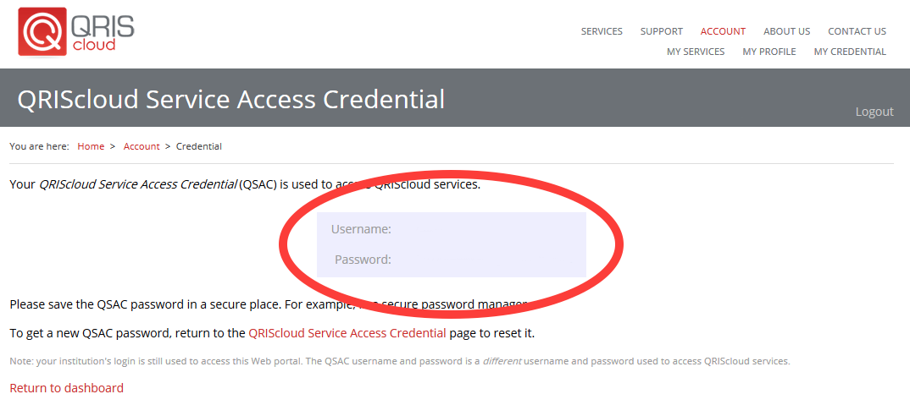

Reset your Access Credential
============================

Unable to remember your QRIScloud password? Follow the below steps to reset it.

Navigate to https://www.qriscloud.org.au and click on 'Account'

Now, click on 'Login'

Search for "James Cook University", select it and click 'Continue to your organisation'

You will be redirected to the standard JCU login page. Please enter your credentials.

On the top right hand corner, click on 'My Credential'.
This page allows you to reset your password if required.

Click on 'Reset password'

Your username and password have now been generated. Remember them, they will be used to access Mediaflux and/or Aspera Shares at JCU.
They can also be used to access other services provided by QRIScloud.

