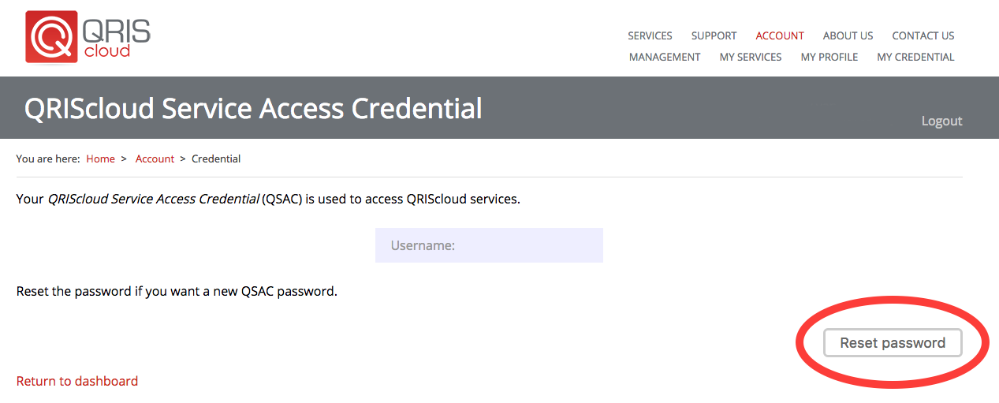

Reset your Access Credential
============================

.. raw:: html

    

Unable to remember your QRIScloud password? Follow the below steps to reset it.

1. Navigate to https://www.qriscloud.org.au and click on 'Account'

.. image:: _static/QRIScloud_main.png
   :width: 100%
   :alt: Login page for QRIScloud services

2. Now, click on 'Login'

.. image:: _static/QRIScloud_login.png
   :width: 100%
   :alt: Login page for QRIScloud services

3. Search for "James Cook University", select it and click 'Continue to your organisation'

.. image:: _static/QRIScloud_AAF.png
   :width: 100%
   :alt: Select your organisation

4. You will be redirected to the standard JCU login page. Please enter your credentials.

.. image:: _static/JCU_cas.png
   :width: 100%
   :alt: Select your organisation

5. On the top right hand corner, click on 'My Credential'.
This page allows you to reset your password if required.

6. Click on 'Reset password'

7. Your username and password have now been generated. Remember them, they will be used to access Mediaflux and/or Aspera Shares at JCU.
They can also be used to access other services provided by QRIScloud.

